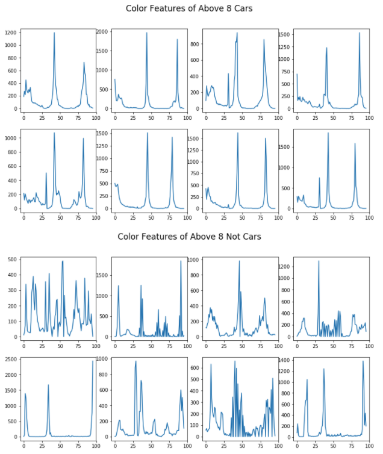

# Vehicle Detection with Histogram of Oriented Gradients and a Support Vector Machine Classifier
 <figure>
  
</figure>
 

In this repository, I'll make a first stab at detecting and tracking other vehicles on the road without resorting to Deep Learning. Namely, I'll train a Support Vector Machine classifier to detect cars. Using a video taken from a camera mounted on a car's hood, I'll use a sliding window approach to scan each frame of the video and detect where the classifier believes other cars may be, then use heatmaps to filter out false positives.

In addition to the algorithm in vehicle_detection.py, the contents of this repository include two videos, test_video.mp4 to test the algorithm, and the longer project_video.mp4. The 'vehicles' directory contains 64x64 images of cars from the rear and the side. The 'novehicles' directory contains 64x64 images of patches of road and other scenes a camera mounted on the hood of a car might come across that aren't cars. The 'output_video' directory contains my results. 

### 1) Exploratory data analysis
<figure>
  
</figure>
 

Before training the classifier on the vehicles and novehicles images, we have to decide which features to use. I use three techniques to extract features, then concatenate them into one vector. I landed on each of the three techniques and their respective hyperparameters and color spaces through visual EDA, making sure that each technique clearly would help the Support Vector Machine classifier distinguish between images of cars and not-cars. 

I extract spatial features by resizing each image to 16x16 pixels and converting it to HLS color space (line 56 of vehicled_detection.py). 
<figure>
  
</figure>
 

I extract color features by converting the 64x64 images into YCrCb color space, calculating the histogram of each channel separately with 32 bins, then combining them into a single vector (line 63). 
<figure>
  
</figure>
 

Finally, I extract features using Histogram of Oriented Gradients on a grayscale image with 12 orientation bins, 8x8 pixels per cell, and 2x2 cells per block (line 36). 
<figure>
  
</figure>
 

I extract features from the novehicle images twice, once for the normal image and once for a horizonatlly flipped version of it. This allows the SVM classifier to see about twice as many images without vehicles as those with vehicles. I did this to help reduce the amount of false positives because in any given frame there will be more windows without cars than with. 

After extracting features from the images, I scale them to have zero mean and unit variance.

### 2) Train Support Vector Machine classifier
I split the data into training, validation and test sets. The test set uses the first 10% of the GTI images because they are in chronological order, ensuring that the classifier hasn't been trained on images that are essentially identical to the test images. I ran several SVMs before landing on the best performer. For this problem, the best performer achieves a validation accuracy of 100% and a test accuracy of 95%, using a penalty parameter C of 100 and a Radial Basis Function kernel with a coefficient of 1/n_features or 0.0003.

### 3) Implement sliding windows over each frame
I slide windows over each frame, using my trained classifier to decide whether the window contains a car. I use four different window sizes, 64x64 for the cars farthest away that appear smaller, 96x96 for the mid-range cars, and 128x128 and 160x160 for cars closest to mine. The smallest windows overlap by 50%, while the rest overlap by 75%. I chose these overlap percentages to ensure that the larger windows don't accidentally skip over a car and to track cars close the right edge of the frame image. 
<figure>
  
</figure>
 

<figure>
  
</figure>
 

 
### 4) Use heatmaps to filter out false positives
Because the smaller windows overlap with the larger ones and all windows overlap with themselves, I use a heatmap so only patches in a single frame that were classified as containing cars by at least two windows count (line 141). I use [scipy.ndimage.measurements.label](https://docs.scipy.org/doc/scipy-0.16.0/reference/generated/scipy.ndimage.measurements.label.html) to distinguish between the different detected patches. Furthermore, since there is little movement within a range of, say, five frames, I keep track of past detected patches. For a patch to count, the classifier must detect it as containing a car for the current frame as well as the previous four (line 148). In addition to filtering out false positives, this helps smooth the shape of the boxes.
<figure>
  
</figure>
 

 
 The result of running the entire algorithm on the image is the first image at the top of this README.
 
 ### 5) Why this probably isn't the best approach
Two limitations of this algorithm instantly jump out. First of all, sliding windows are too computationally expensive to work in real time without some serious custom CPU parallelization, and we need it to work in real time if we want to use it in autonomous vehicles. Secondly, take a look at this picture:
 <figure>
  
</figure>
 

See how the bounding boxes combine into one for both cars. Ideally, the algorithm should be able to determine that there are two distinct cars and draw two boxes that overlap. Unfortunately, our algorithm will never be able to do that. 

I believe that an end-to-end Deep Convolutional Network approach, like [YOLO](http://bit.ly/2zoUrp5), may work better. Since Support Vector Machines have issues with massive datasets with lots of features, a Deep Network approach could also help us leverage the large public datasets available for this problem. Plus,
<figure>
  
</figure>
 

 *The YOLO, or rather OOYL, image was taken from https://traciruffner.wordpress.com/2015/08/03/yolo-you-only-live-once/
